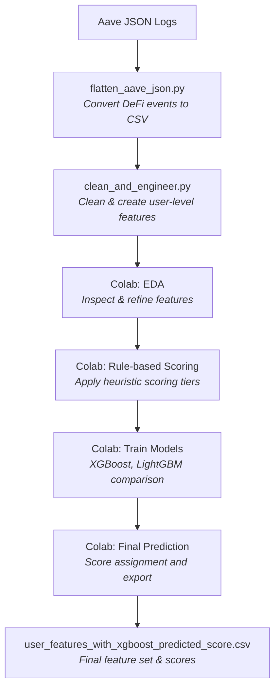

# DeFi Credit Scoring System for Aave V2 Wallets

## Introduction

This project introduces a comprehensive and interpretable credit scoring framework tailored for Ethereum wallets interacting with the Aave V2 lending protocol. It assigns a numerical score between 0 and 1000 to each wallet based purely on its DeFi transaction history. Higher scores reflect trustworthy, consistent behavior, while lower scores indicate potential risk, unreliability, or automated/bot-like activity.

The solution integrates both local processing scripts and cloud-based analysis for efficient development:

- **Python scripts (local)** for structured data extraction and feature creation  
- **Google Colab notebooks** for analysis, heuristics, machine learning models, and result interpretation

All code, artifacts, and documentation required for full reproducibility are included in this repository.

---

## Project Directory

```
├── flatten_json.py              # (Local) Converts nested JSON to flat CSV format  
├── cleaning_and_engineering.py            # (Local) Cleans data and constructs features  
├── modelTraining_and_analysis.ipynb # (Colab) Full pipeline: EDA, ML scoring, visualization 
├── output_files and user_features.csv                   # flattened, cleaned, and engineered data 
├── user_features_newscored.csv      # Final feature set with heuristic and model-based scores
├── user_features_with_xgboost_predicted_score.csv # Final feature set with heuristic and model-based scores  
├── README.md                        # This file  
├── analysis.md                      # In-depth post-scoring analysis and visualizations  
└──
```

---

## Scoring System: Logic & Rationale

Each Ethereum wallet is rated on a 0–1000 scale. A higher value signals responsible usage of DeFi platforms, while a lower value denotes high-risk or exploitative behavior.

### Key Feature Groups:

- Volume and frequency of **deposits, borrows, repayments, withdrawals, and liquidations** (in counts and USD-equivalent).
- **Risk ratios**, such as liquidation percentage, borrow-to-repay ratio, and protocol utilization.
- **Behavioral indicators**, including token diversity and the time span of wallet activity.

### Score Assignment Strategy:

- Wallets with no borrow, repay, or liquidation activity receive a **default baseline score**.
- Active users are scored via a weighted formula:
  - Positive behaviors (repayment history, diverse token interactions, longer active period) increase the score.
  - Risky behaviors (frequent liquidations, overleveraging, poor repay ratios) reduce it significantly.
  - Features are scaled logarithmically and capped where necessary to limit outlier influence.

### Why XGBoost?

XGBoost was selected for its robustness with skewed and sparse DeFi datasets. It performs well in real-world credit modeling tasks by:

- Handling extreme values and missing data gracefully
- Capturing complex, non-linear relationships
- Offering feature importance insights for interpretability

When benchmarked against models like LightGBM, XGBoost achieved better performance on both RMSE and R² metrics.

---

## End-to-End Pipeline

**Step 1:**  
`flatten_aave_json.py`  
- Converts complex, nested Aave V2 transaction logs into flat, structured CSV files by action type (e.g., borrow, repay, deposit).

**Step 2:**  
`clean_and_engineer.py`  
- Cleans and processes the tabular data, builds wallet-level features such as transaction volume, event counts, behavior ratios, and more.

**Step 3:**  
`model_training_and_analysis.ipynb`  
Includes four major stages:

1. **Exploratory Data Analysis (EDA)**  
   - Visual inspection of features  
   - Elimination of constant or irrelevant columns  
   - Outlier and distribution checks

2. **Heuristic-Based Scoring**  
   - Assigns preliminary scores using interpretable rules  
   - Segregates wallets into scoring tiers (e.g., Inactive, Prime, Subprime)  
   - Applies normalization, feature caps, and weights backed by DeFi research

3. **Machine Learning Modeling**  
   - Builds predictive models (XGBoost, LightGBM) using labeled features  
   - Compares models and finalizes predictions based on validation metrics

4. **Visualization & Interpretation**  
   - Plots score distributions, feature relationships  
   - Validates results with boxplots, histograms, and other charts

---

## How to Execute

1. Place your raw Aave V2 JSON data in the local environment.
2. Run `flatten_aave_json.py` to convert JSON into CSV format.
3. Execute `clean_and_engineer.py` to produce `user_features.csv`, containing all model-ready features.
4. Upload the resulting CSV to Colab.
5. Launch and run the `model_training_and_analysis.ipynb` notebook for data analysis, score generation, and exporting final results.

---

## Architecture Diagram



---

## Methodology Highlights

- **Fully Transparent:**  
  All steps, decisions, and feature engineering are well-documented and easy to interpret.

- **Aligned with DeFi Risk Models:**  
  Liquidations are penalized heavily; consistent, long-term, and diversified activity is rewarded.

- **Careful Model Selection:**  
  XGBoost was picked based on real performance metrics for accuracy and explainability.

- **User Banding:**  
  Credit bands (e.g., Prime, Subprime) simplify downstream decision-making or analytics.

---

## Included Assets

- Local Python scripts (`.py`) and Colab notebook (`.ipynb`)
- Final engineered dataset and scores
- In-depth behavioral analysis in [analysis.md](analysis.md)

---

## Author

**Brajesh Kumar**  
📧 kumarbrajesh7927@gmail.com